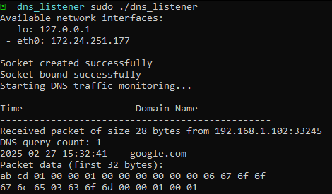

<h1 align="center">✨ DNS Listener ✨</h1>

<h6 align="center"><em>Simple & lightweight DNS listener for linux</em></h6>

## 📝 Overview

This is a simple linux program which monitors DNS traffic (i.e. domain ip resolution).
It works by leveraging the linux socket implementation from libc. It will display all relevant DNS information from the incoming and outgoing traffic. Note that super user privileges are required.

## 🚀 Installation

Grab the compiled binary [here](./bin/dns_listener),
otherwise see the release section.

Optionally, you can compile it from source:

```sh
git clone https://github.com/Arty3/DNS-Listener.git
cd DNS-Listener
```

###### _Make sure you have make and GCC or clang installed_

```sh
make all
```

## 💻 Usage

Simply run the program using sudo:

```sh
sudo ./dns_listener
```

You should see something like:



## ⚠ Limitations

- Linux Only
- Fails with some custom name servers

## 📃 License
This project uses the `GNU GENERAL PUBLIC LICENSE v3.0` license
<br>
For more info, please find the `LICENSE` file here: [License](LICENSE)
